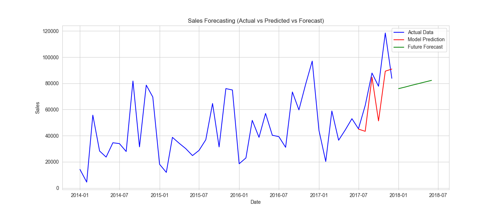

# 📊 Sales Forecasting using Time Series Analysis

> A beginner-friendly Data Science project demonstrating time series forecasting using real-world sales data.

---

## 📌 Objective

To analyze historical sales data and forecast future trends using time series models.

---

## 📂 Dataset

* Superstore Sales Dataset
* Contains order date, sales, profit, and regional data

---

## 🛠 Tools & Technologies

* Python (pandas, matplotlib, seaborn)
* statsmodels (Exponential Smoothing, ARIMA)
* scikit-learn (RMSE evaluation)

---

## 📈 Methodology

1. Data preprocessing and cleaning
2. Time series aggregation (monthly sales)
3. Model building:

   * Exponential Smoothing
   * ARIMA
4. Model evaluation using RMSE
5. Forecasting future sales

---

## 📊 Results


**Model Performance:**
- RMSE: ~27780

---

## 🧠 Key Insights

* Sales show an overall upward trend
* High volatility indicates irregular demand patterns
* Models capture trend but struggle with sharp fluctuations
* Model performance indicates need for more advanced time series techniques for better accuracy

---

## ⚠️ Limitations

* Basic models fail to capture sudden spikes
* Forecast accuracy can be improved with advanced models

---

## 💡 Business Recommendations

* Use forecasts for strategic planning, not exact predictions
* Investigate causes of sudden sales spikes
* Apply advanced forecasting models for better accuracy

---

## 📁 Project Structure

```
sales-forecasting-project/
│
├── data/                # Dataset
├── notebook/            # Jupyter notebook
├── output/              # Saved graphs
└── README.md
```

---

## ▶️ How to Run

1. Clone the repository
2. Install required libraries:

```
pip install pandas matplotlib seaborn scikit-learn statsmodels
```

3. Open the notebook:

```
jupyter notebook
```

4. Run all cells to reproduce results

---
## 🎯 Motivation

This project was built as part of my preparation for Data Science master's programs. 
I focused on understanding how time series forecasting works on real business data.
